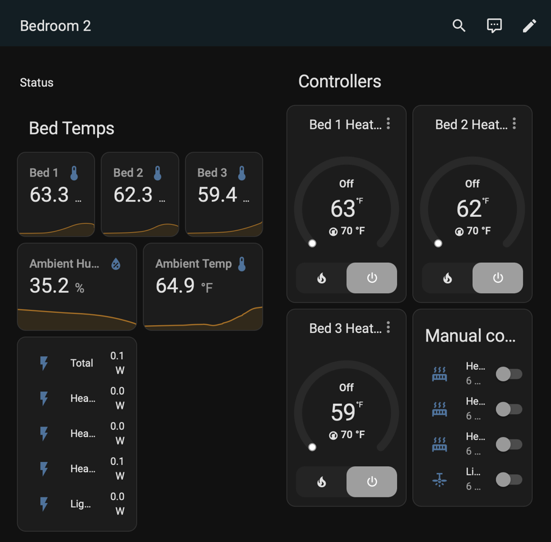

# Yet Another Home Assistant Temperatue Monitor

Use Raspberry Pi Pico W and micropython to add temperature sensors to your Home Assitant setup.



# Installation

## Micropython and libraries

Usually you'll start with the [latest micropython for Pico W][latest_micropython].

On your workstation, you will also want [`mpremote`][mpremote]

The README goes into this. There is `mip_install.py` that relies on `secrets.py` being properly configured (see [Config](#config) below)  and copied to Pico W.

## Hardware Setup

### DS18B20

DS18B20 1-Wire sensors are `3.3 V`. Fortunately, the Pico W has a regulated `3.3 V` output that can be used.

### I2C

TODO: I2C like BME280 or SSD1306 OLED.


## Test

There are assorted micropython scripts name `test_AREA.py`

```
moremote run test_ds18b20.py
```

## Config

There are example files intended to be used as configuration templates.

 - `config.py`
 - `device.py`
 - `def-secrets.py` -> `secrets.py`

Since I may have more than one `picow` in use, I like to have local corresponding device files, e.g., `device-picow1.py`


```shell
mpremote fs cp secrets.py :
mpremote fs cp config.py :
mpremote fs cp device-picow1.py :device.py

# testing them out
mpremote run main.py
```

## Running

Micropython auto-runs a file named `main.py` in the top-level directory. Assuming it has been configured and tested, can just copy to device.

```
mpremote fs cp main.py :

# Power cycle or otherwise reset, and it should start up automatically.

mpremote repl
```


[latest_micropython]: https://micropython.org/download/RPI_PICO_W/
[mpremote]: https://docs.micropython.org/en/latest/reference/mpremote.html
